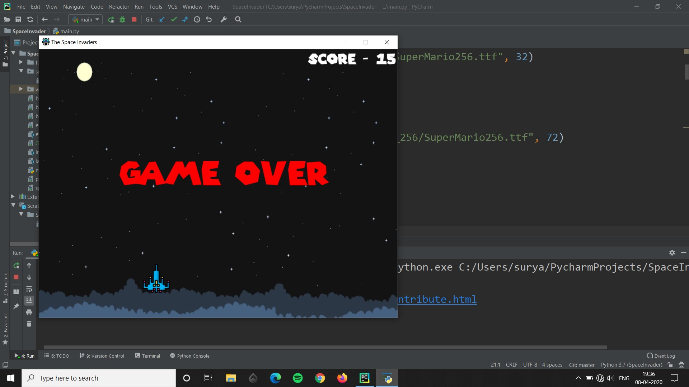

# SpaceInvader
The classic arcade game "The Space Invaders"

# How to Play
The player can move only in horizontal direction using the left and the right arrow keys with  fixed speed. The enemies aka the aliens will also be moving with a specific speed in the horizontal direction and will move down each time they touch any wall.

Here is a screeshot of the game :-

## How to Shoot
The player has to shoot bullets using the spacebar and destory as many aliens as they can to increase their score. Destroying one alien adds one point to score.

## Game Over
The game will be over once the alien crosses the line of last defence.

### PEACE.

# SPIRIT OUT >>>> >>
